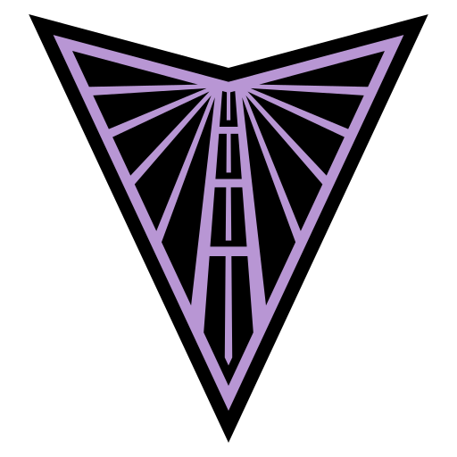
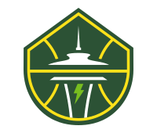
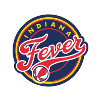
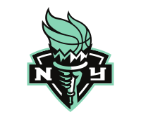

# FIBA Women's Basketball World Cup 2026

Berlin · 4–13 September 2026 · all times **America/Los_Angeles**

Games are grouped by *your* local day, which can differ from the Berlin match day — the Berlin date is shown on each game.

## Friday, September 4, 2026

- **2:30 am** — [Japan vs Mali](https://www.fiba.basketball/en/events/fiba-womens-basketball-world-cup-2026/games/128116-JPN-MLI)  ·  Group A · Game 1
  - 🏟 Berlin: Fri 4 Sep, 11:30 · Berlin Arena
  - 📺 Watch (US): [Courtside 1891](https://www.dazn.com/en-CH/competition/Competition:66bytlledogulmhfeqyirijs3) · [HBOMax](https://play.hbomax.com/)
  - 🇯🇵 **Japan** — WNBA players:
    - **LVA**  Las Vegas Aces — Mai Yamamoto
  - 🇲🇱 **Mali** — WNBA players:
    - **ATL**  Atlanta Dream — Sika Koné

- **2:30 am** — [Australia vs Puerto Rico](https://www.fiba.basketball/en/events/fiba-womens-basketball-world-cup-2026/games/128129-AUS-PUR)  ·  Group C · Game 5
  - 🏟 Berlin: Fri 4 Sep, 11:30 · Max-Schmeling-Halle
  - 📺 Watch (US): [Courtside 1891](https://www.dazn.com/en-CH/competition/Competition:66bytlledogulmhfeqyirijs3) · [HBOMax](https://play.hbomax.com/)
  - 🇦🇺 **Australia** — WNBA players:
    - **ATL**  Atlanta Dream — Isobel Borlase
    - **DAL**  Dallas Wings — Alanna Smith
    - **GSV**  Golden State Valkyries — Miela Sowah
    - **LVA**  Las Vegas Aces — Stephanie Talbot
    - **MIN**  Minnesota Lynx — Chloe Bibby
    - **SEA**  Seattle Storm — Ezi Magbegor, Jade Melbourne

- **5:15 am** — [USA vs China](https://www.fiba.basketball/en/events/fiba-womens-basketball-world-cup-2026/games/128134-USA-CHN)  ·  Group D · Game 6
  - 🏟 Berlin: Fri 4 Sep, 14:15 · Max-Schmeling-Halle
  - 📺 Watch (US): [Courtside 1891](https://www.dazn.com/en-CH/competition/Competition:66bytlledogulmhfeqyirijs3) · [TNT](https://www.tntsports.com/)
  - 🇺🇸 **USA** — WNBA players:
    - **ATL**  Atlanta Dream — Angel Reese, Rhyne Howard
    - **DAL**  Dallas Wings — Paige Bueckers
    - **IND**  Indiana Fever — Aliyah Boston, Caitlin Clark
    - **LVA**  Las Vegas Aces — Chelsea Gray, Jackie Young
    - **MIN**  Minnesota Lynx — Napheesa Collier
    - **NYL**  New York Liberty — Breanna Stewart
    - **PHX**  Phoenix Mercury — Kahleah Copper
    - **WAS**  Washington Mystics — Kiki Iriafen, Sonia Citron
  - 🇨🇳 **China** — WNBA players:
    - **NYL**  New York Liberty — Han Xu

- **5:30 am** — [Korea vs Nigeria](https://www.fiba.basketball/en/events/fiba-womens-basketball-world-cup-2026/games/128123-KOR-NGR)  ·  Group B · Game 2
  - 🏟 Berlin: Fri 4 Sep, 14:30 · Berlin Arena
  - 📺 Watch (US): [Courtside 1891](https://www.dazn.com/en-CH/competition/Competition:66bytlledogulmhfeqyirijs3) · [HBOMax](https://play.hbomax.com/)
  - 🇰🇷 **Korea** — WNBA players:
    - **LAS**  Los Angeles Sparks — Jihyun Park
  - 🇳🇬 **Nigeria** — WNBA players:
    - **NYL**  New York Liberty — Elizabeth Balogun
    - **POR**  Portland Fire — Amy Okonkwo

- **8:30 am** — [Belgium vs Türkiye](https://www.fiba.basketball/en/events/fiba-womens-basketball-world-cup-2026/games/128128-BEL-TUR)  ·  Group C · Game 7
  - 🏟 Berlin: Fri 4 Sep, 17:30 · Max-Schmeling-Halle
  - 📺 Watch (US): [Courtside 1891](https://www.dazn.com/en-CH/competition/Competition:66bytlledogulmhfeqyirijs3) · [HBOMax](https://play.hbomax.com/)
  - 🇧🇪 **Belgium** — WNBA players:
    - **MIN**  Minnesota Lynx — Antonia Delaere
    - **PHX**  Phoenix Mercury — Kyara Linskens
    - **TOR**  Toronto Tempo — Julie Allemand
  - 🇹🇷 **Türkiye** — WNBA players:
    - **CON**  Connecticut Sun — Kennedy Burke

- **8:45 am** — [Spain vs Germany](https://www.fiba.basketball/en/events/fiba-womens-basketball-world-cup-2026/games/128117-ESP-GER)  ·  Group A · Game 3
  - 🏟 Berlin: Fri 4 Sep, 17:45 · Berlin Arena
  - 📺 Watch (US): [Courtside 1891](https://www.dazn.com/en-CH/competition/Competition:66bytlledogulmhfeqyirijs3) · [TNT](https://www.tntsports.com/)
  - 🇪🇸 **Spain** — WNBA players:
    - **MIN**  Minnesota Lynx — Elena Buenavida
    - **NYL**  New York Liberty — Raquel Carrera
    - **POR**  Portland Fire — Megan DiLeo
    - **SEA**  Seattle Storm — Awa Fam
    - **TOR**  Toronto Tempo — María Conde
    - **WAS**  Washington Mystics — Alicia Flórez
  - 🇩🇪 **Germany** — WNBA players:
    - **NYL**  New York Liberty — Leonie Fiebich
    - **POR**  Portland Fire — Frieda Bühner, Luisa Geiselsöder
    - **TOR**  Toronto Tempo — Nyara Sabally

- **11:15 am** — [Czechia vs Italy](https://www.fiba.basketball/en/events/fiba-womens-basketball-world-cup-2026/games/128135-CZE-ITA)  ·  Group D · Game 8
  - 🏟 Berlin: Fri 4 Sep, 20:15 · Max-Schmeling-Halle
  - 📺 Watch (US): [Courtside 1891](https://www.dazn.com/en-CH/competition/Competition:66bytlledogulmhfeqyirijs3) · [HBOMax](https://play.hbomax.com/)
  - 🇨🇿 **Czechia** — WNBA players:
    - **MIN**  Minnesota Lynx — Eliška Joklová
  - 🇮🇹 **Italy** — WNBA players:
    - **DAL**  Dallas Wings — Costanza Verona
    - **GSV**  Golden State Valkyries — Cecilia Zandalasini

- **12 pm** — [Hungary vs France](https://www.fiba.basketball/en/events/fiba-womens-basketball-world-cup-2026/games/128122-HUN-FRA)  ·  Group B · Game 4
  - 🏟 Berlin: Fri 4 Sep, 21:00 · Berlin Arena
  - 📺 Watch (US): [Courtside 1891](https://www.dazn.com/en-CH/competition/Competition:66bytlledogulmhfeqyirijs3) · [TNT](https://www.tntsports.com/)
  - 🇭🇺 **Hungary** — WNBA players:
    - **MIN**  Minnesota Lynx — Dorka Juhász
  - 🇫🇷 **France** — WNBA players:
    - **CON**  Connecticut Sun — Leïla Lacan
    - **GSV**  Golden State Valkyries — Gabby Williams, Janelle Salaün
    - **NYL**  New York Liberty — Marine Johannès, Pauline Astier
    - **PHX**  Phoenix Mercury — Valériane Ayayi
    - **POR**  Portland Fire — Carla Leite
    - **SEA**  Seattle Storm — Dominique Malonga

## Saturday, September 5, 2026

- **2:30 am** — [Mali vs Spain](https://www.fiba.basketball/en/events/fiba-womens-basketball-world-cup-2026/games/128119-MLI-ESP)  ·  Group A · Game 9
  - 🏟 Berlin: Sat 5 Sep, 11:30 · Max-Schmeling-Halle
  - 📺 Watch (US): [Courtside 1891](https://www.dazn.com/en-CH/competition/Competition:66bytlledogulmhfeqyirijs3) · [HBOMax](https://play.hbomax.com/)
  - 🇲🇱 **Mali** — WNBA players:
    - **ATL**  Atlanta Dream — Sika Koné
  - 🇪🇸 **Spain** — WNBA players:
    - **MIN**  Minnesota Lynx — Elena Buenavida
    - **NYL**  New York Liberty — Raquel Carrera
    - **POR**  Portland Fire — Megan DiLeo
    - **SEA**  Seattle Storm — Awa Fam
    - **TOR**  Toronto Tempo — María Conde
    - **WAS**  Washington Mystics — Alicia Flórez

- **5:15 am** — [Nigeria vs Hungary](https://www.fiba.basketball/en/events/fiba-womens-basketball-world-cup-2026/games/128124-NGR-HUN)  ·  Group B · Game 10
  - 🏟 Berlin: Sat 5 Sep, 14:15 · Max-Schmeling-Halle
  - 📺 Watch (US): [Courtside 1891](https://www.dazn.com/en-CH/competition/Competition:66bytlledogulmhfeqyirijs3) · [HBOMax](https://play.hbomax.com/)
  - 🇳🇬 **Nigeria** — WNBA players:
    - **NYL**  New York Liberty — Elizabeth Balogun
    - **POR**  Portland Fire — Amy Okonkwo
  - 🇭🇺 **Hungary** — WNBA players:
    - **MIN**  Minnesota Lynx — Dorka Juhász

- **9 am** — [Germany vs Japan](https://www.fiba.basketball/en/events/fiba-womens-basketball-world-cup-2026/games/128118-GER-JPN)  ·  Group A · Game 11
  - 🏟 Berlin: Sat 5 Sep, 18:00 · Max-Schmeling-Halle
  - 📺 Watch (US): [Courtside 1891](https://www.dazn.com/en-CH/competition/Competition:66bytlledogulmhfeqyirijs3) · [HBOMax](https://play.hbomax.com/)
  - 🇩🇪 **Germany** — WNBA players:
    - **NYL**  New York Liberty — Leonie Fiebich
    - **POR**  Portland Fire — Frieda Bühner, Luisa Geiselsöder
    - **TOR**  Toronto Tempo — Nyara Sabally
  - 🇯🇵 **Japan** — WNBA players:
    - **LVA**  Las Vegas Aces — Mai Yamamoto

- **11:45 am** — [France vs Korea](https://www.fiba.basketball/en/events/fiba-womens-basketball-world-cup-2026/games/128125-FRA-KOR)  ·  Group B · Game 12
  - 🏟 Berlin: Sat 5 Sep, 20:45 · Max-Schmeling-Halle
  - 📺 Watch (US): [Courtside 1891](https://www.dazn.com/en-CH/competition/Competition:66bytlledogulmhfeqyirijs3) · [HBOMax](https://play.hbomax.com/)
  - 🇫🇷 **France** — WNBA players:
    - **CON**  Connecticut Sun — Leïla Lacan
    - **GSV**  Golden State Valkyries — Gabby Williams, Janelle Salaün
    - **NYL**  New York Liberty — Marine Johannès, Pauline Astier
    - **PHX**  Phoenix Mercury — Valériane Ayayi
    - **POR**  Portland Fire — Carla Leite
    - **SEA**  Seattle Storm — Dominique Malonga
  - 🇰🇷 **Korea** — WNBA players:
    - **LAS**  Los Angeles Sparks — Jihyun Park

## Sunday, September 6, 2026

- **2:30 am** — [Türkiye vs Australia](https://www.fiba.basketball/en/events/fiba-womens-basketball-world-cup-2026/games/128131-TUR-AUS)  ·  Group C · Game 13
  - 🏟 Berlin: Sun 6 Sep, 11:30 · Berlin Arena
  - 📺 Watch (US): [Courtside 1891](https://www.dazn.com/en-CH/competition/Competition:66bytlledogulmhfeqyirijs3) · [HBOMax](https://play.hbomax.com/)
  - 🇹🇷 **Türkiye** — WNBA players:
    - **CON**  Connecticut Sun — Kennedy Burke
  - 🇦🇺 **Australia** — WNBA players:
    - **ATL**  Atlanta Dream — Isobel Borlase
    - **DAL**  Dallas Wings — Alanna Smith
    - **GSV**  Golden State Valkyries — Miela Sowah
    - **LVA**  Las Vegas Aces — Stephanie Talbot
    - **MIN**  Minnesota Lynx — Chloe Bibby
    - **SEA**  Seattle Storm — Ezi Magbegor, Jade Melbourne

- **5:30 am** — [China vs Czechia](https://www.fiba.basketball/en/events/fiba-womens-basketball-world-cup-2026/games/128137-CHN-CZE)  ·  Group D · Game 14
  - 🏟 Berlin: Sun 6 Sep, 14:30 · Berlin Arena
  - 📺 Watch (US): [Courtside 1891](https://www.dazn.com/en-CH/competition/Competition:66bytlledogulmhfeqyirijs3) · [HBOMax](https://play.hbomax.com/)
  - 🇨🇳 **China** — WNBA players:
    - **NYL**  New York Liberty — Han Xu
  - 🇨🇿 **Czechia** — WNBA players:
    - **MIN**  Minnesota Lynx — Eliška Joklová

- **8:45 am** — [Puerto Rico vs Belgium](https://www.fiba.basketball/en/events/fiba-womens-basketball-world-cup-2026/games/128130-PUR-BEL)  ·  Group C · Game 15
  - 🏟 Berlin: Sun 6 Sep, 17:45 · Berlin Arena
  - 📺 Watch (US): [Courtside 1891](https://www.dazn.com/en-CH/competition/Competition:66bytlledogulmhfeqyirijs3) · [TNT](https://www.tntsports.com/)
  - 🇧🇪 **Belgium** — WNBA players:
    - **MIN**  Minnesota Lynx — Antonia Delaere
    - **PHX**  Phoenix Mercury — Kyara Linskens
    - **TOR**  Toronto Tempo — Julie Allemand

- **11:45 am** — [Italy vs USA](https://www.fiba.basketball/en/events/fiba-womens-basketball-world-cup-2026/games/128136-ITA-USA)  ·  Group D · Game 16
  - 🏟 Berlin: Sun 6 Sep, 20:45 · Berlin Arena
  - 📺 Watch (US): [Courtside 1891](https://www.dazn.com/en-CH/competition/Competition:66bytlledogulmhfeqyirijs3) · [TNT](https://www.tntsports.com/)
  - 🇮🇹 **Italy** — WNBA players:
    - **DAL**  Dallas Wings — Costanza Verona
    - **GSV**  Golden State Valkyries — Cecilia Zandalasini
  - 🇺🇸 **USA** — WNBA players:
    - **ATL**  Atlanta Dream — Angel Reese, Rhyne Howard
    - **DAL**  Dallas Wings — Paige Bueckers
    - **IND**  Indiana Fever — Aliyah Boston, Caitlin Clark
    - **LVA**  Las Vegas Aces — Chelsea Gray, Jackie Young
    - **MIN**  Minnesota Lynx — Napheesa Collier
    - **NYL**  New York Liberty — Breanna Stewart
    - **PHX**  Phoenix Mercury — Kahleah Copper
    - **WAS**  Washington Mystics — Kiki Iriafen, Sonia Citron

## Monday, September 7, 2026

- **2:30 am** — [Belgium vs Australia](https://www.fiba.basketball/en/events/fiba-womens-basketball-world-cup-2026/games/128132-BEL-AUS)  ·  Group C · Game 17
  - 🏟 Berlin: Mon 7 Sep, 11:30 · Berlin Arena
  - 📺 Watch (US): [Courtside 1891](https://www.dazn.com/en-CH/competition/Competition:66bytlledogulmhfeqyirijs3) · [HBOMax](https://play.hbomax.com/)
  - 🇧🇪 **Belgium** — WNBA players:
    - **MIN**  Minnesota Lynx — Antonia Delaere
    - **PHX**  Phoenix Mercury — Kyara Linskens
    - **TOR**  Toronto Tempo — Julie Allemand
  - 🇦🇺 **Australia** — WNBA players:
    - **ATL**  Atlanta Dream — Isobel Borlase
    - **DAL**  Dallas Wings — Alanna Smith
    - **GSV**  Golden State Valkyries — Miela Sowah
    - **LVA**  Las Vegas Aces — Stephanie Talbot
    - **MIN**  Minnesota Lynx — Chloe Bibby
    - **SEA**  Seattle Storm — Ezi Magbegor, Jade Melbourne

- **2:30 am** — [Puerto Rico vs Türkiye](https://www.fiba.basketball/en/events/fiba-womens-basketball-world-cup-2026/games/128133-PUR-TUR)  ·  Group C · Game 21
  - 🏟 Berlin: Mon 7 Sep, 11:30 · Max-Schmeling-Halle
  - 📺 Watch (US): [Courtside 1891](https://www.dazn.com/en-CH/competition/Competition:66bytlledogulmhfeqyirijs3) · [HBOMax](https://play.hbomax.com/)
  - 🇹🇷 **Türkiye** — WNBA players:
    - **CON**  Connecticut Sun — Kennedy Burke

- **5:30 am** — [Nigeria vs France](https://www.fiba.basketball/en/events/fiba-womens-basketball-world-cup-2026/games/128127-NGR-FRA)  ·  Group B · Game 18
  - 🏟 Berlin: Mon 7 Sep, 14:30 · Berlin Arena
  - 📺 Watch (US): [Courtside 1891](https://www.dazn.com/en-CH/competition/Competition:66bytlledogulmhfeqyirijs3) · [TNT](https://www.tntsports.com/)
  - 🇳🇬 **Nigeria** — WNBA players:
    - **NYL**  New York Liberty — Elizabeth Balogun
    - **POR**  Portland Fire — Amy Okonkwo
  - 🇫🇷 **France** — WNBA players:
    - **CON**  Connecticut Sun — Leïla Lacan
    - **GSV**  Golden State Valkyries — Gabby Williams, Janelle Salaün
    - **NYL**  New York Liberty — Marine Johannès, Pauline Astier
    - **PHX**  Phoenix Mercury — Valériane Ayayi
    - **POR**  Portland Fire — Carla Leite
    - **SEA**  Seattle Storm — Dominique Malonga

- **5:30 am** — [Hungary vs Korea](https://www.fiba.basketball/en/events/fiba-womens-basketball-world-cup-2026/games/128126-HUN-KOR)  ·  Group B · Game 22
  - 🏟 Berlin: Mon 7 Sep, 14:30 · Max-Schmeling-Halle
  - 📺 Watch (US): [Courtside 1891](https://www.dazn.com/en-CH/competition/Competition:66bytlledogulmhfeqyirijs3) · [HBOMax](https://play.hbomax.com/)
  - 🇭🇺 **Hungary** — WNBA players:
    - **MIN**  Minnesota Lynx — Dorka Juhász
  - 🇰🇷 **Korea** — WNBA players:
    - **LAS**  Los Angeles Sparks — Jihyun Park

- **8:50 am** — [Germany vs Mali](https://www.fiba.basketball/en/events/fiba-womens-basketball-world-cup-2026/games/128121-GER-MLI)  ·  Group A · Game 19
  - 🏟 Berlin: Mon 7 Sep, 17:50 · Berlin Arena
  - 📺 Watch (US): [Courtside 1891](https://www.dazn.com/en-CH/competition/Competition:66bytlledogulmhfeqyirijs3) · [HBOMax](https://play.hbomax.com/)
  - 🇩🇪 **Germany** — WNBA players:
    - **NYL**  New York Liberty — Leonie Fiebich
    - **POR**  Portland Fire — Frieda Bühner, Luisa Geiselsöder
    - **TOR**  Toronto Tempo — Nyara Sabally
  - 🇲🇱 **Mali** — WNBA players:
    - **ATL**  Atlanta Dream — Sika Koné

- **8:50 am** — [Japan vs Spain](https://www.fiba.basketball/en/events/fiba-womens-basketball-world-cup-2026/games/128120-JPN-ESP)  ·  Group A · Game 23
  - 🏟 Berlin: Mon 7 Sep, 17:50 · Max-Schmeling-Halle
  - 📺 Watch (US): [Courtside 1891](https://www.dazn.com/en-CH/competition/Competition:66bytlledogulmhfeqyirijs3) · [TNT](https://www.tntsports.com/)
  - 🇯🇵 **Japan** — WNBA players:
    - **LVA**  Las Vegas Aces — Mai Yamamoto
  - 🇪🇸 **Spain** — WNBA players:
    - **MIN**  Minnesota Lynx — Elena Buenavida
    - **NYL**  New York Liberty — Raquel Carrera
    - **POR**  Portland Fire — Megan DiLeo
    - **SEA**  Seattle Storm — Awa Fam
    - **TOR**  Toronto Tempo — María Conde
    - **WAS**  Washington Mystics — Alicia Flórez

- **11:45 am** — [USA vs Czechia](https://www.fiba.basketball/en/events/fiba-womens-basketball-world-cup-2026/games/128138-USA-CZE)  ·  Group D · Game 20
  - 🏟 Berlin: Mon 7 Sep, 20:45 · Berlin Arena
  - 📺 Watch (US): [Courtside 1891](https://www.dazn.com/en-CH/competition/Competition:66bytlledogulmhfeqyirijs3) · [TNT](https://www.tntsports.com/)
  - 🇺🇸 **USA** — WNBA players:
    - **ATL**  Atlanta Dream — Angel Reese, Rhyne Howard
    - **DAL**  Dallas Wings — Paige Bueckers
    - **IND**  Indiana Fever — Aliyah Boston, Caitlin Clark
    - **LVA**  Las Vegas Aces — Chelsea Gray, Jackie Young
    - **MIN**  Minnesota Lynx — Napheesa Collier
    - **NYL**  New York Liberty — Breanna Stewart
    - **PHX**  Phoenix Mercury — Kahleah Copper
    - **WAS**  Washington Mystics — Kiki Iriafen, Sonia Citron
  - 🇨🇿 **Czechia** — WNBA players:
    - **MIN**  Minnesota Lynx — Eliška Joklová

- **11:45 am** — [Italy vs China](https://www.fiba.basketball/en/events/fiba-womens-basketball-world-cup-2026/games/128139-ITA-CHN)  ·  Group D · Game 24
  - 🏟 Berlin: Mon 7 Sep, 20:45 · Max-Schmeling-Halle
  - 📺 Watch (US): [Courtside 1891](https://www.dazn.com/en-CH/competition/Competition:66bytlledogulmhfeqyirijs3) · [HBOMax](https://play.hbomax.com/)
  - 🇮🇹 **Italy** — WNBA players:
    - **DAL**  Dallas Wings — Costanza Verona
    - **GSV**  Golden State Valkyries — Cecilia Zandalasini
  - 🇨🇳 **China** — WNBA players:
    - **NYL**  New York Liberty — Han Xu

## Tuesday, September 8, 2026

- **8:45 am or 11:45 am (slot TBA)** — [2nd A - 3rd B](https://www.fiba.basketball/en/events/fiba-womens-basketball-world-cup-2026/games/128144)  ·  Qualification to Quarter-Finals · Game 25 · _matchup TBD_
  - 🏟 Berlin: Tue 8 Sep, 17:45 · Berlin Arena
  - 📺 Watch (US): _not yet listed_

- **8:45 am or 11:45 am (slot TBA)** — [2nd B - 3rd A](https://www.fiba.basketball/en/events/fiba-womens-basketball-world-cup-2026/games/128145)  ·  Qualification to Quarter-Finals · Game 26 · _matchup TBD_
  - 🏟 Berlin: Tue 8 Sep, 17:45 · Berlin Arena
  - 📺 Watch (US): _not yet listed_

## Wednesday, September 9, 2026

- **8:45 am or 11:45 am (slot TBA)** — [3rd D - 2nd C](https://www.fiba.basketball/en/events/fiba-womens-basketball-world-cup-2026/games/128146)  ·  Qualification to Quarter-Finals · Game 27 · _matchup TBD_
  - 🏟 Berlin: Wed 9 Sep, 17:45 · Berlin Arena
  - 📺 Watch (US): _not yet listed_

- **8:45 am or 11:45 am (slot TBA)** — [3rd C - 2nd D](https://www.fiba.basketball/en/events/fiba-womens-basketball-world-cup-2026/games/128147)  ·  Qualification to Quarter-Finals · Game 28 · _matchup TBD_
  - 🏟 Berlin: Wed 9 Sep, 17:45 · Berlin Arena
  - 📺 Watch (US): _not yet listed_

## Thursday, September 10, 2026

- **2:30 am** — [Quarter-Final 1: W27 - 1st A](https://www.fiba.basketball/en/events/fiba-womens-basketball-world-cup-2026/games/128148)  ·  Quarter-Finals · Game 29 · _matchup TBD_
  - 🏟 Berlin: Thu 10 Sep, 11:30 · Berlin Arena
  - 📺 Watch (US): _not yet listed_

- **5:30 am** — [Quarter-Final 2: W28 - 1st B](https://www.fiba.basketball/en/events/fiba-womens-basketball-world-cup-2026/games/128149)  ·  Quarter-Finals · Game 30 · _matchup TBD_
  - 🏟 Berlin: Thu 10 Sep, 14:30 · Berlin Arena
  - 📺 Watch (US): _not yet listed_

- **8:45 am** — [Quarter-Final 3: 1st C - W25](https://www.fiba.basketball/en/events/fiba-womens-basketball-world-cup-2026/games/128150)  ·  Quarter-Finals · Game 31 · _matchup TBD_
  - 🏟 Berlin: Thu 10 Sep, 17:45 · Berlin Arena
  - 📺 Watch (US): _not yet listed_

- **11:45 am** — [Quarter-Final 4: 1st D - W26](https://www.fiba.basketball/en/events/fiba-womens-basketball-world-cup-2026/games/128151)  ·  Quarter-Finals · Game 32 · _matchup TBD_
  - 🏟 Berlin: Thu 10 Sep, 20:45 · Berlin Arena
  - 📺 Watch (US): _not yet listed_

## Saturday, September 12, 2026

- **7:30 am or 11 am (slot TBA)** — [Semi-Final: W29 - W32](https://www.fiba.basketball/en/events/fiba-womens-basketball-world-cup-2026/games/128152)  ·  Semi-Finals · Game 33 · _matchup TBD_
  - 🏟 Berlin: Sat 12 Sep, 16:30 · Berlin Arena
  - 📺 Watch (US): _not yet listed_

- **7:30 am or 11 am (slot TBA)** — [Semi-Final: W30 - W31](https://www.fiba.basketball/en/events/fiba-womens-basketball-world-cup-2026/games/128153)  ·  Semi-Finals · Game 34 · _matchup TBD_
  - 🏟 Berlin: Sat 12 Sep, 16:30 · Berlin Arena
  - 📺 Watch (US): _not yet listed_

## Sunday, September 13, 2026

- **7:30 am** — [3rd Place Game](https://www.fiba.basketball/en/events/fiba-womens-basketball-world-cup-2026/games/128154)  ·  3rd Place Game · Game 35 · _matchup TBD_
  - 🏟 Berlin: Sun 13 Sep, 16:30 · Berlin Arena
  - 📺 Watch (US): _not yet listed_

- **11 am** — [Final](https://www.fiba.basketball/en/events/fiba-womens-basketball-world-cup-2026/games/128155)  ·  Final · Game 36 · _matchup TBD_
  - 🏟 Berlin: Sun 13 Sep, 20:00 · Berlin Arena
  - 📺 Watch (US): _not yet listed_

## WNBA clubs at the World Cup

###  Atlanta Dream (ATL)

- 🇦🇺 Australia — Isobel Borlase
- 🇲🇱 Mali — Sika Koné
- 🇺🇸 USA — Angel Reese
- 🇺🇸 USA — Rhyne Howard

###  Connecticut Sun (CON)

- 🇫🇷 France — Leïla Lacan
- 🇹🇷 Türkiye — Kennedy Burke

###  Dallas Wings (DAL)

- 🇦🇺 Australia — Alanna Smith
- 🇮🇹 Italy — Costanza Verona
- 🇺🇸 USA — Paige Bueckers

###  Golden State Valkyries (GSV)

- 🇦🇺 Australia — Miela Sowah
- 🇫🇷 France — Gabby Williams
- 🇫🇷 France — Janelle Salaün
- 🇮🇹 Italy — Cecilia Zandalasini

###  Indiana Fever (IND)

- 🇺🇸 USA — Aliyah Boston
- 🇺🇸 USA — Caitlin Clark

###  Los Angeles Sparks (LAS)

- 🇰🇷 Korea — Jihyun Park

###  Las Vegas Aces (LVA)

- 🇦🇺 Australia — Stephanie Talbot
- 🇯🇵 Japan — Mai Yamamoto
- 🇺🇸 USA — Chelsea Gray
- 🇺🇸 USA — Jackie Young

###  Minnesota Lynx (MIN)

- 🇦🇺 Australia — Chloe Bibby
- 🇧🇪 Belgium — Antonia Delaere
- 🇨🇿 Czechia — Eliška Joklová
- 🇭🇺 Hungary — Dorka Juhász
- 🇪🇸 Spain — Elena Buenavida
- 🇺🇸 USA — Napheesa Collier

###  New York Liberty (NYL)

- 🇨🇳 China — Han Xu
- 🇫🇷 France — Marine Johannès
- 🇫🇷 France — Pauline Astier
- 🇩🇪 Germany — Leonie Fiebich
- 🇳🇬 Nigeria — Elizabeth Balogun
- 🇪🇸 Spain — Raquel Carrera
- 🇺🇸 USA — Breanna Stewart

###  Phoenix Mercury (PHX)

- 🇧🇪 Belgium — Kyara Linskens
- 🇫🇷 France — Valériane Ayayi
- 🇺🇸 USA — Kahleah Copper

###  Portland Fire (POR)

- 🇫🇷 France — Carla Leite
- 🇩🇪 Germany — Frieda Bühner
- 🇩🇪 Germany — Luisa Geiselsöder
- 🇳🇬 Nigeria — Amy Okonkwo
- 🇪🇸 Spain — Megan DiLeo

###  Seattle Storm (SEA)

- 🇦🇺 Australia — Ezi Magbegor
- 🇦🇺 Australia — Jade Melbourne
- 🇫🇷 France — Dominique Malonga
- 🇪🇸 Spain — Awa Fam

###  Toronto Tempo (TOR)

- 🇧🇪 Belgium — Julie Allemand
- 🇩🇪 Germany — Nyara Sabally
- 🇪🇸 Spain — María Conde

###  Washington Mystics (WAS)

- 🇪🇸 Spain — Alicia Flórez
- 🇺🇸 USA — Kiki Iriafen
- 🇺🇸 USA — Sonia Citron

_No players in the tournament:_ Chicago Sky
